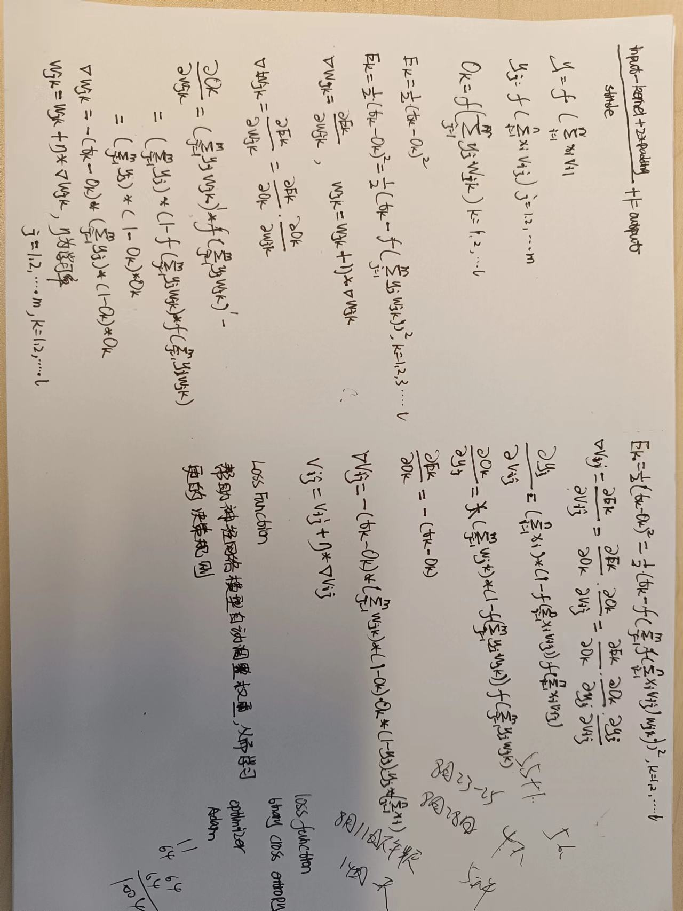

# Pandoc document template

## Description

This repository contains a simple template for building
[Pandoc](http://pandoc.org/) documents; Pandoc is a suite of tools to compile
markdown files into readable files (PDF, EPUB, HTML...).

## 基本概念

### 神经网路公式推导


- [公式](https://blog.csdn.net/qq_52785473/article/details/127454390)

### 损失函数

``http://nj.itheima.com/news/20230815/104216.html``

在人工智能领域，特别是在机器学习和深度学习中，损失函数(也称为代价函数、目标函数或误差函数)是一种用于衡量模型预测与实际观测值之间差异的指标。损失函数的作用非常重要，它在训练模型过程中起到以下几个关键作用：

　　1.衡量模型性能。损失函数用来度量模型的预测结果与真实标签之间的差异。一个好的模型应该能够将损失降至最小，即预测结果与实际标签尽可能接近，从而更准确地完成任务。

　　2.训练优化。机器学习和深度学习模型的训练过程是一个优化问题，目标是最小化损失函数。通过不断调整模型的参数，使损失函数逐渐减小，模型的预测能力也逐渐提升。常用的优化算法如梯度下降就是通过计算损失函数的梯度来更新模型参数。

　　3.反向传播。在深度学习中，反向传播是一种基于链式法则的算法，用于计算损失函数对模型中每个参数的梯度。这些梯度指示了参数调整方向，以最小化损失函数。反向传播使得神经网络能够自动学习特征和权重，以适应任务。

4.模型选择与调参。不同的任务和模型可能需要不同的损失函数。选择合适的损失函数可以影响模型在特定任务上的表现。例如，回归任务通常使用均方误差(MSE)，分类任务常用交叉熵损失函数。在调参过程中，损失函数的表现也常被用来评估不同超参数的效果。

　　5.防止过拟合。过拟合是指模型在训练数据上表现良好，但在新数据上表现较差的现象。损失函数可以帮助在训练过程中监控模型的过拟合情况。通过观察训练集和验证集上的损失，可以及早发现模型是否过拟合，从而采取相应的措施，如正则化等。

　　6.加权和多目标优化。在一些情况下，不同的样本或不同的目标可能有不同的重要性。损失函数可以引入权重，用于平衡不同样本或目标之间的重要性，从而更精确地衡量模型性能。

　　总之，损失函数在人工智能领域中起着至关重要的作用，它不仅是模型训练和优化的基础，也是评估模型性能、解决过拟合问题以及指导模型选择的重要工具。不同的损失函数适用于不同的问题和算法，选择合适的损失函数对于取得良好的模型性能至关重要。

### 神经网络中优化器的作用

``https://blog.51cto.com/u_16175512/7859880``

优化器是一种用于调整模型参数的重要工具。优化器的目标是通过最小化损失函数来提高模型的性能。

作用：
优化器的作用是通过调整模型的参数来最小化损失函数。在训练神经网络时，模型会根据输入数据进行前向传播，并计算出预测值和实际值之间的差异，既损失。优化器根据损失的大小来调整模型的参数，使得下一次预测可以更接近实际值。

优化器的目标是找到使得损失函数最小化的参数组合。为了实现这一目标，优化器使用了不同的算法来更新模型的参数。常见的优化器算法包括随机梯度下降法(SGD)、Adam、RMSprop等。


## Pima Indians

  - Load Data
  - Define PyTorch Model
  - Define Loss Function and Optimizers
  - Run a Training Loop
  - Evaluate the Model
  - Make Predictions

### Define The Model

```
class PimaClassifier(nn.Module):
    def __init__(self):
        super().__init__()
        self.hidden1 = nn.Linear(8, 12)
        self.act1 = nn.ReLU()
        self.hidden2 = nn.Linear(12, 8)
        self.act2 = nn.ReLU()
        self.output = nn.Linear(8, 1)
        self.act_output = nn.Sigmoid()
 
    def forward(self, x):
        x = self.act1(self.hidden1(x))
        x = self.act2(self.hidden2(x))
        x = self.act_output(self.output(x))
        return x

model = PimaClassifier()
print(model)
```
The model printed will be:

```
PimaClassifier(
  (hidden1): Linear(in_features=8, out_features=12, bias=True)
  (act1): ReLU()
  (hidden2): Linear(in_features=12, out_features=8, bias=True)
  (act2): ReLU()
  (output): Linear(in_features=8, out_features=1, bias=True)
  (act_output): Sigmoid()
)
```

### Define Loss Function and Optimizers

```
loss_fn = nn.BCELoss()
optimizer = optim.Adam(model.parameters(), lr=0.001)
```

### Training a Model

```
n_epochs = 100
batch_size = 10

for epoch in range(n_epochs):
    for i in range(0,len(x),batch_size):
	Xbatch=X[i:i+batch_size]
	y_pred=model(Xbatch)
	ybatch=y[i:i+batch_size]
	loss=loss_fn(y_pred,ybatch)
	optimizer.zero_grad()
	loss.backward()
	optimizer.step()
    print(f'Finished epoch {epoch}, latest loss {loss}')
```
### Evaluate the Model

```
with torch.no_grad():
    y_pred = model(X)
accuracy = (y_pred.round() == y).float().mean()
print(f"Accuracy {accuracy}")
```
输出结果如下所示
```
Accuracy 0.78515625
```
### Make Predictions

```
predictions = (model(X) > 0.5).int()
for i in range(5):
    print('%s => %d (expected %d)' % (X[i].tolist(), predictions[i], y[i]))
```
输出结果如下所示：
```
[6.0, 148.0, 72.0, 35.0, 0.0, 33.599998474121094, 0.6269999742507935, 50.0] => 1 (expected 1)
[1.0, 85.0, 66.0, 29.0, 0.0, 26.600000381469727, 0.35100001096725464, 31.0] => 0 (expected 0)
[8.0, 183.0, 64.0, 0.0, 0.0, 23.299999237060547, 0.671999990940094, 32.0] => 1 (expected 1)
[1.0, 89.0, 66.0, 23.0, 94.0, 28.100000381469727, 0.16699999570846558, 21.0] => 0 (expected 0)
[0.0, 137.0, 40.0, 35.0, 168.0, 43.099998474121094, 2.2880001068115234, 33.0] => 1 (expected 1)
```

完整代码如下所示：
```
import numpy as np
import torch
import torch.nn as nn
import torch.optim as optim

# load the dataset, split into input (X) and output (y) variables
dataset = np.loadtxt('pima-indians-diabetes.data.csv', delimiter=',')
x = dataset[:,0:8]
y = dataset[:,8]

X = torch.tensor(x, dtype=torch.float32)
Y = torch.tensor(y, dtype=torch.float32).reshape(-1, 1)

# define the model
class PimaClassifier(nn.Module):
    def __init__(self):
        super().__init__()
        self.hidden1 = nn.Linear(8, 12)
        self.act1 = nn.ReLU()
        self.hidden2 = nn.Linear(12, 8)
        self.act2 = nn.ReLU()
        self.output = nn.Linear(8, 1)
        self.act_output = nn.Sigmoid()

    def forward(self, x):
        x = self.act1(self.hidden1(x))
        x = self.act2(self.hidden2(x))
        x = self.act_output(self.output(x))
        return x

model = PimaClassifier()
print(model)

# train the model
loss_fn   = nn.BCELoss()  # binary cross entropy
optimizer = optim.Adam(model.parameters(), lr=0.001)

n_epochs = 100
batch_size = 10

for epoch in range(n_epochs):
    for i in range(0, len(X), batch_size):
        Xbatch = X[i:i+batch_size]
        y_pred = model(Xbatch)
        ybatch = Y[i:i+batch_size]
        loss = loss_fn(y_pred, ybatch)
        optimizer.zero_grad()
        loss.backward()
        optimizer.step()
    print(f'Finished epoch {epoch}, latest loss {loss}')    

# compute accuracy
y_pred = model(X)
accuracy = (y_pred.round() == Y).float().mean()
print(f"Accuracy {accuracy}")

# make class predictions with the model
predictions = (model(X) > 0.5).int()
for i in range(5):
    print('%s => %d (expected %d)' % (X[i].tolist(), predictions[i], Y[i]))
```

- [Ref](https://machinelearningmastery.com/develop-your-first-neural-network-with-pytorch-step-by-step/)


Here's a folder structure for a Pandoc document:

```
my-document/     # Root directory.
|- build/        # Folder used to store builded (output) files.
|- src/          # Markdowns files; one for each chapter.
|- images/       # Images folder.
|- metadata.yml  # Metadata content (title, author...).
|- Makefile      # Makefile used for building our documents.
```

### Setup generic data

Edit the *metadata.yml* file to set configuration data:

```yml
---
title: My document title
author: Ralph Huwiler
rights:  Creative Commons Attribution 4.0 International
language: en-US
tags: [document, my-document, etc]
abstract: |
  Your summary text.
---
```

You can find the list of all available keys on [this
page](http://pandoc.org/MANUAL.html#extension-yaml_metadata_block).

### Creating chapters

Creating a new chapter is as simple as creating a new markdown file in the
*src/* folder; you'll end up with something like this:

```
src/01-introduction.md
src/02-installation.md
src/03-usage.md
src/04-references.md
```

Pandoc and Make will join them automatically ordered by name; that's why the
numeric prefixes are being used.

All you need to specify for each chapter at least one title:

```md
# Introduction

This is the first paragraph of the introduction chapter.

## First

This is the first subsection.

## Second

This is the second subsection.
```

Each title (*#*) will represent a chapter, while each subtitle (*##*) will
represent a chapter's section. You can use as many levels of sections as
markdown supports.

#### Links between chapters

Anchor links can be used to link chapters within the document:

```md
// src/01-introduction.md
# Introduction

For more information, check the [Usage] chapter.

// src/02-installation.md
# Usage

...
```

If you want to rename the reference, use this syntax:

```md
For more information, check [this](#usage) chapter.
```

Anchor names should be downcased, and spaces, colons, semicolons... should be
replaced with hyphens. Instead of `Chapter title: A new era`, you have:
`#chapter-title-a-new-era`.

#### Links between sections

It's the same as anchor links:

```md
# Introduction

## First

For more information, check the [Second] section.

## Second

...
```

Or, with al alternative name:

```md
For more information, check [this](#second) section.
```

### Inserting objects

Text. That's cool. What about images and tables?

#### Insert an image

Use Markdown syntax to insert an image with a caption:

```md

```

Pandoc will automatically convert the image into a figure (image + caption).

If you want to resize the image, you may use this syntax, available in Pandoc
1.16:

```md
{ width=50% height=50% }
```

Also, to reference an image, use LaTeX labels:

```md
Please, admire the gloriousnes of Figure \ref{seagull_image}.


```

#### Insert a table

Use markdown table, and use the `Table: <Your table description>` syntax to add
a caption:

```md
| Index | Name |
| ----- | ---- |
| 0     | AAA  |
| 1     | BBB  |
| ...   | ...  |

Table: This is an example table.
```

If you want to reference a table, use LaTeX labels:

```md
Please, check Table /ref{example_table}.

| Index | Name |
| ----- | ---- |
| 0     | AAA  |
| 1     | BBB  |
| ...   | ...  |

Table: This is an example table.\label{example_table}
```

#### Insert an equation

Wrap a LaTeX math equation between `$` delimiters for inline (tiny) formulas:

```md
This, $\mu = \sum_{i=0}^{N} \frac{x_i}{N}$, the mean equation, ...
```

Pandoc will transform them automatically into images using online services.

If you want to center the equation instead of inlining it, use double `$$`
delimiters:

```md
$$\mu = \sum_{i=0}^{N} \frac{x_i}{N}$$
```

[Here](https://www.codecogs.com/latex/eqneditor.php)'s an online equation
editor.

### Output

This template uses *Makefile* to automatize the building process. Instead of
using the *pandoc cli util*, we're going to use some *make* commands.

#### Export to PDF

Use this command:

```sh
make pdf
```

The generated file will be placed in *build/pdf*.

Please, note that PDF file generation requires some extra dependencies (~ 800
MB):

```sh
sudo apt-get install texlive-latex-base texlive-fonts-recommended texlive-latex-extra 
```

#### Export to EPUB

Use this command:

```sh
make epub
```

The generated file will be placed in *build/epub*.

#### Export to HTML

Use this command:

```sh
make html
```

The generated file(s) will be placed in *build/html*.

## References

- [Pandoc](http://pandoc.org/)
- [Pandoc Manual](http://pandoc.org/MANUAL.html)
- [Wikipedia: Markdown](http://wikipedia.org/wiki/Markdown)
